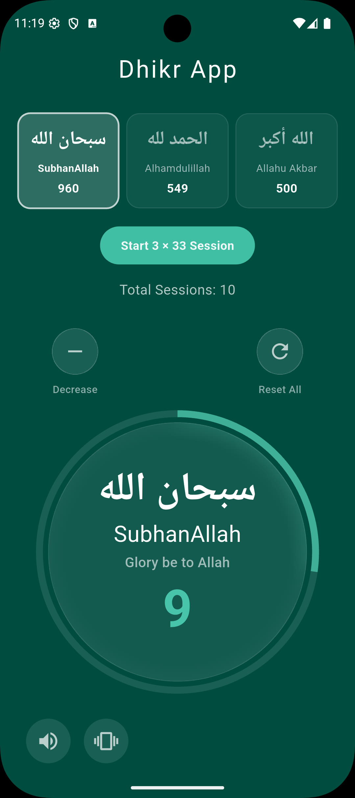

# 📿 Modern Dhikr Counter

A premium, high-performance Dhikr application built with **Flutter**. This app features a sophisticated **Glassmorphism UI**, real-time haptic feedback, and an automated session logic designed for a seamless spiritual experience.

---

## ✨ Features

* **Glassmorphism Design:** A beautiful "frosted glass" interface with dynamic background blurs that change based on the Dhikr phase.
* **Smart Auto-Session:** Automatically transitions through the 33-count cycle:
    * *SubhanAllah* ➔ *Alhamdulillah* ➔ *Allahu Akbar*.
* **Instant Transition:** Moves to the next phase immediately upon the 33rd tap.
* **Visual Confirmation:** Briefly shows "33" before switching so you can see your progress.
* **Audio & Haptic Feedback:** * Gentle vibrations on every tap.
    * Success sound played **only** upon completing the full 99-cycle.
* **Data Persistence:** Uses **SQLite (sqflite)** to ensure your totals and settings are saved even after closing the app.
* **State Management:** Powered by **Riverpod** for a reactive and bug-free user experience.

---

## 🛠️ Tech Stack

| Technology | Purpose |
| :--- | :--- |
| **Flutter** | UI Framework |
| **Riverpod** | State Management |
| **sqflite** | Local SQLite Database |
| **audioplayers** | Audio Feedback |
| **vibration** | Haptic Feedback |

---
# 📿ScreenShots

